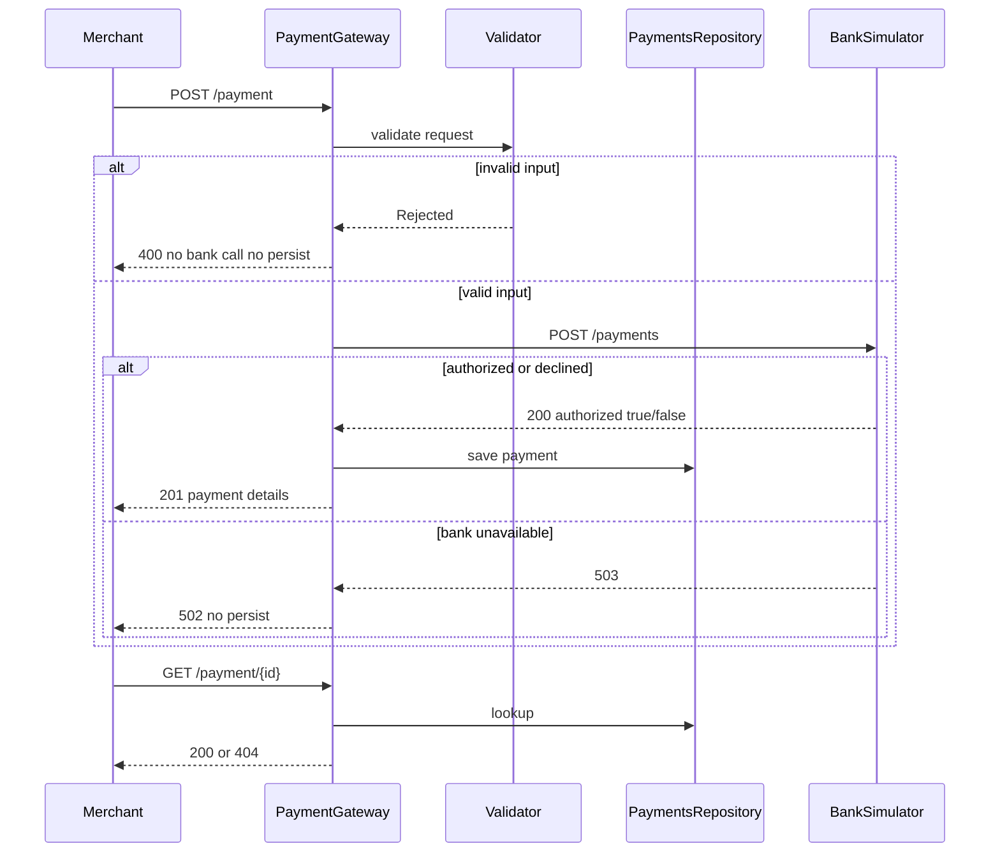

# Payment Gateway — Design Document

## Architecture

The application follows a layered architecture:

```
Controller → Service → Validator / BankClient / Repository
```

| Layer | Responsibility |
|-------|----------------|
| **Controller** | HTTP mapping, status codes, OpenAPI documentation |
| **Service** | Orchestration: validate → bank call → persist → respond |
| **Validator** | Business-rule validation before any external call |
| **Bank Client** | HTTP integration with the acquiring bank simulator |
| **Repository** | In-memory storage of authorized/declined payments |



## Assumptions

- **Storage**: In-memory `HashMap` — data is lost on restart. Suitable for the assessment scope.
- **Currencies**: Only `USD`, `GBP`, and `EUR` are accepted.
- **JSON conventions**: Gateway API request uses snake_case (`card_number`, `expiry_month`); gateway response uses camelCase (`cardNumberLastFour`). Bank API uses snake_case per the simulator spec.
- **Rejected payments**: Validation failures return `400` with `status: Rejected`. No bank call, no persistence.
- **Bank 503**: Cards ending in `0` trigger a bank `503`. Gateway returns `502 Bad Gateway` and does not persist.
- **PCI**: Full card numbers and CVV are never logged, stored, or returned. Only the last four digits are persisted.

## Security

- PAN and CVV are redacted in `toString()` on request models.
- Bank client logs only currency and amount — never card data.
- Service logs `paymentId`, `status`, and `durationMs` only.

## Error Model

| Condition | HTTP | Bank called? | Persisted? | Response body |
|-----------|------|--------------|------------|---------------|
| Validation failure | 400 | No | No | `{ "code": "VALIDATION_ERROR", "message", "errors": [...] }` |
| Authorized | 201 | Yes | Yes | Payment details |
| Declined | 201 | Yes | Yes | Payment details |
| Bank unavailable (503) | 502 | Yes | No | `{ "code": "BANK_UNAVAILABLE", "message": "..." }` |
| Payment not found | 404 | No | No | `{ "code": "NOT_FOUND", "message": "Payment with id ... not found" }` |

## Test Card Cheat Sheet

| Last digit of card number | Result |
|---------------------------|--------|
| 1, 3, 5, 7, 9 | Authorized |
| 2, 4, 6, 8 | Declined |
| 0 | Bank 503 → Gateway 502 |

## Running Locally

```bash
# Start the bank simulator
docker-compose up -d

# Run the application (port 8090)
./gradlew bootRun

# Run tests (no Docker required — bank client is mocked in controller tests)
./gradlew test

# Build a runnable JAR
./gradlew bootJar
```

### Swagger / OpenAPI

Interactive API docs: **http://localhost:8090/swagger-ui/index.html**

### Health Check

Actuator health endpoint: **http://localhost:8090/actuator/health**

